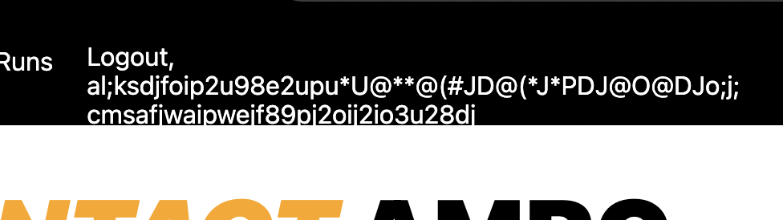

## Amigo Mio Run Club

This is the home of the running club I started in my city. I'm building this site with [Next.js](https://nextjs.org/) (a React framework), [CSS Styled Components](https://styled-components.com/), [Contentful](https://www.contentful.com/) (a headless CMS for our blog posts), and Netlify for [user authentication](https://docs.netlify.com/visitor-access/identity/) & [website deployment](https://www.netlify.com/).

I'm going to transparently talk about my working to-dos and publicly explain what I'm working. I'll add ~~strikethroughs~~ when I've completed a todo.

### Running Todos:

- username validation (can I add ontop of Netlify Identity?)
  - no special characters
  - max length of 15
  - numbers okay (regex: `/^[a-z0-9]+$/i`)

- Next.JS: redirect pages based on `user state`
  - if `user` is on page only viewable when logged-in and they then logout, we should be redirect back to the homepage.
